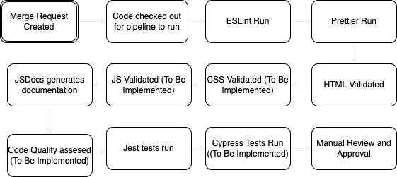

# CI-CD Pipeline

## What Was Discussed:

1. Definately start workflow after creating a pull request:

2. Lint
    - Eslint for javascript
    - prettier for html/css

3. Documentation Pt2.
    - use JSDocs to use code comments, function headers/class headers to fill out n.

3. Code Quality:
    - HTML5 Validator
      - need to add prettier extension because otherwise clashes with prettier formatting
    - Codeclimate ??

4. Testing
    - No automated testing at the moment, will figure this is out throughout week 8 after doing the related lab
    - Possible tools:
        - Jest
        - Cypress

5. Request a Review:
    - request a manual review on the pull request, this will send a slack message and email to the requested reviewer.  
    - The reviewer should suggest any possible changes in which case the pipeline will be re run once the said changes have been made or they can approve the pull request and merge.
    - Manual Review:
        - Request a review, a message will be sent via email and slack

## Final Pipline:

1. Developer creates a pull request to be merged into main
2. ESLint is run to check for linting 
3. Prettier is run to check for code formatiing
4. HTML is validated with html-validator
5. CSS is validated (in phase 2)
6. JS is validated (in phase 2)
7. Documentaion is generated with JSDocs
8. Code quality assesed (not sure about which tool yet)
9. Jest Testing run on all test.js files in repo
10. Jest Code Coverage (not implemented yet)
11. Cypress testing (not implemented just yet)
12. Manual Review by other developer and they suggest changes or approve and merge changes

### Diagram:

## What Works What Doesn't:

The pipline we plan on implementing has 12 total steps. We decided that since the main branch holds the final version of code and all pushes to the main branch will come from pull requests, the pipeline will executee on pull requests to the main branch. We decided to house the entire workflow in the main.yaml file under .github/workflows. The diagram below shows the order in which the pipeline executes. 

Here is a description of what has currently been implemented into the workflow:

The linting step has been implemented which is done by ESlint. The pipline will use eslint to check for any linting errors. If they are found, the pipeline will fail in which case they will have to locally try and fix linting errors, push the changes, and have the pipeline run again. Rules we are speecifically checking for during linting have been specified in the .eslintrc.json file. Prettier has also been implemented into the pipeline and will run after the linting step. In this step, the all code in the ./source directory will be checked to see if it follows the prettier format. HTML validation is the next step which has already been implemented. This uses the html-validator package to validate all html files in our ./source directory. In phas 2, we will also implement validations for JS and CSS tht will come afteer the HTML Validation. The next part we have already implemented is using jsdocs for documentation. We will be running jsdocs on all files in the ./source direcotry and saving it to the ./docs directory. The next part we have already implemented are jest tests. Towards the end of the pipeline, we run all the jest test files we will have undeer the ./source/tests direectory. Currently, there is one example test (example_test.test.js) to show that thesee test files will run. 

The following describes what is in the workflow but we have not fully implemented yet:

As said before we want JS and CSS Validation as well. We also want code quality to be asseseed using an external tool however we are unsure of what tool to use. We are currently looking various options like code climate. We also want to see the coverage we are geetting of our jest tests and will implement that in the future. Cypreess testing is another form of testing we want to incorporate into our pipeline as it will help with end to end testing. 

The final part after the pipeline is done is out code will be reviewed by another developer (one who did not create the pull request) and they will either request changes or merge the changes into main.