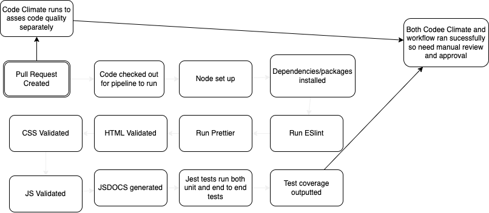

# CI-CD Pipeline Phase 2

## What Was Discussed:

1. Most things preetty much stay the same from phase 1
2. Remove cypress testing because already have jest andpupetter to do both unit and end to end testing
3. Add Validation of CSS with css-validator
4. Add Validation of JS with node --check
5. Code Climate is the tool we have decided to go through with for code quality assesment
   1. works separately from github workflow though
6. Is a node project so need to set up node in workflow

## Final Pipline:

1. Developer creates a pull request to be merged into main
2. ESLint is run to check for linting 
3. Prettier is run to check for code formatiing
4. HTML is validated with html-validator
5. CSS is validated 
6. JS is validated 
7. Documentaion is generated with JSDocs
8. Code quality assesed (just an echo statement as code climate runs separately on its own)
9. Jest Testing run on all test.js files in repo (unit and end to end testing)
10. Jest Code Coverage Check
11. Manual Review by other developer and they suggest changes or approve and merge changes

### Diagram:

## Final Thoughts:

At this point, every step should work as intended. Soemthing we still need to look a little bit more into is JS Docs and ensuring that the docs generated are actually being replaced and pushed to the repository. If not, we may have to create a new workflow for it that actually pushes the changes to the main branch.