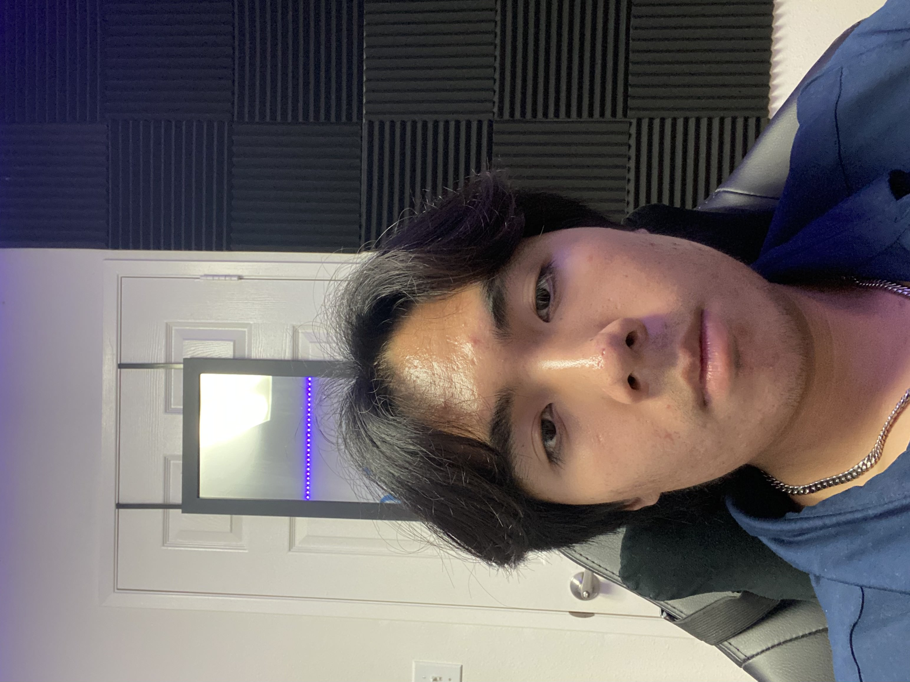
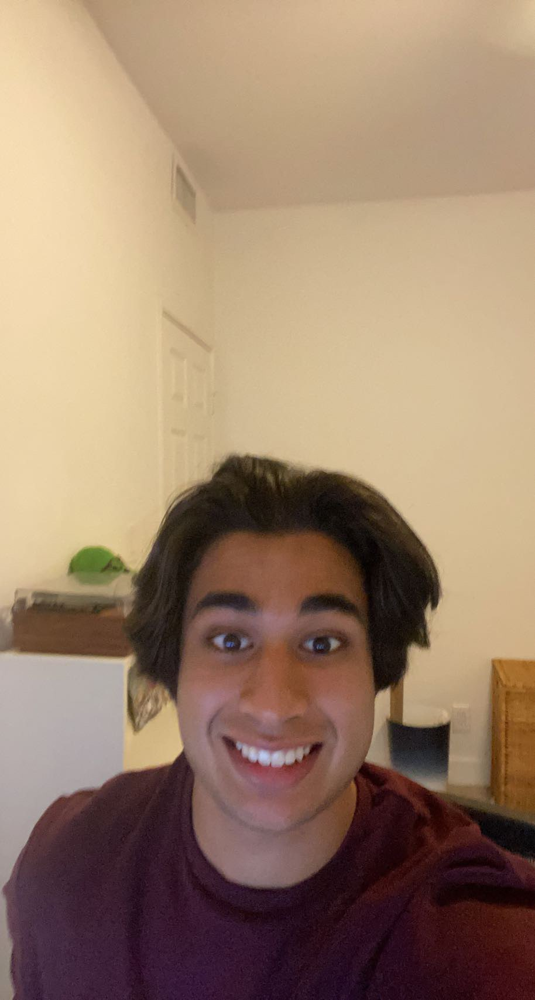
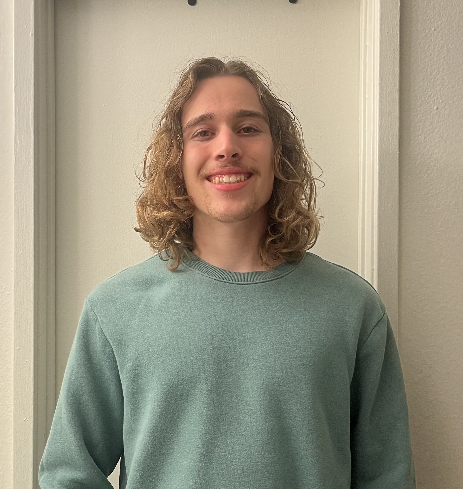

# TEAM 7!

Here at **_TEAM 7_** we value team work and integrity
our core values are 

- Honesty
- Respect
- Dedication
- Perseverance 

## The Crew!

### **Anh Nguyen**

- Computer Science
- Junior
- [Page]((https://sideblade.github.io/CSE110/)

Hi everybody! I'm excited to work with everyone and learn new skills to prepare for the industry. I'm also looking forawrd to working in a new (to me) environment that involves collaboration with a great team.

### **Neal Parimoo**

- Computer Engineering
- Junior
- [Page]( https://nparimoo13.github.io/About-Me/)

I am a third year Computer Engineering major and my goal is that after I have finished this course I will truly understand what it means to be a software engineer and being on a team.

### **Lucas Xu**

- Computer Science

- Junior

- [Page](https://lucas22368.github.io/Projects/)

I'm a normal computer science student. My goals are to make money and get muscles this quarter. In this picture I am not smiling because I just took the midterm

### **Rita Abraham**

- Major: Bioinformatics (Computer Science minor)
- Year: Senior
- Link to my GitHub Page: [Page](https://rabraham-7482.github.io)

Hi! Excited to see how this quarter is going to go and what application we end up making. My goals for the quarter is to learn as much as I can and hopefully apply all these skills in the future.

### **Jenny Nguyen**

- Major: Computer Science
- Year: Junior
- [Page](https://jen013.github.io/User-Page/)

I'm a third year student studying computer science. Since I'm currently undecided on what I'd like to specialize in for my major, I'd like to explore/learn more about different CS fields this quarter.

### **Hongkun Guan**

- Major: Computer Science
- Year: Senior
- [Page](https://hongkun882.github.io/User-Page/)

Hi, everyone! I'm a forth year CS student. My goal of this quarter is learning more CS concepts and deepen my CS knowledge.  

### **Yaosen Zhang**

- Major: Applied Math & Computer Engineering (Double)
- Year: Senior
- [My page](https://neb345.github.io/GitHub-Pages/)

Hi, I feel so great to have this workspace together with my teammeats and exited to start building our project! I'm passioned in robotics and machine learning but also hope to find other things interesting and useful during this quarter.

### **Beomsu Kim**
 - Major: Computer Engineering
 - Year: Senior
 - [Page](https://bkim9.github.io/Bio/)

I am a senior computer engineering major. I just came back from serving military in my country. I hope to have a great time working with my team. I like my short haircut in my picture.

### **Jacob Yenney**

 - Major: Computer Science
 - Year: 3rd
 - [Page](https://jarnke.github.io/CSE110Lab0/)

Hey!  I'm excited to work with everyone this quarter, and hope to learn valuable time/project management skills as we work together to create our app!

 
